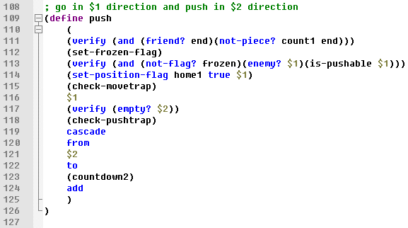
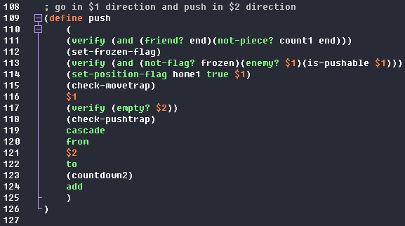

# ZRF syntax highlighting for Notepad++

## Usage

1. Right click **[HERE](https://raw.githubusercontent.com/nyantlet/zrf-npp/master/udl/zrf-dark.xml)** and choose "Save link as...".
    + Dark version: **[HERE](https://raw.githubusercontent.com/nyantlet/zrf-npp/master/udl/zrf-dark.xml)**
2. Copy the XML file to the Notepad++ User Define Language folder.
    + Default location: `%APPDATA%\Notepad++\userDefineLangs`

## Screenshot

| Default |  Dark  |
|:-------:|:------:|
|  |  |

Example code from [here](http://arimaa.com/arimaa/download/).
[Dracula](https://draculatheme.com/notepad-plus-plus/) is used for the dark theme.
Font is [Fixedsys Excelsior](https://github.com/kika/fixedsys).
